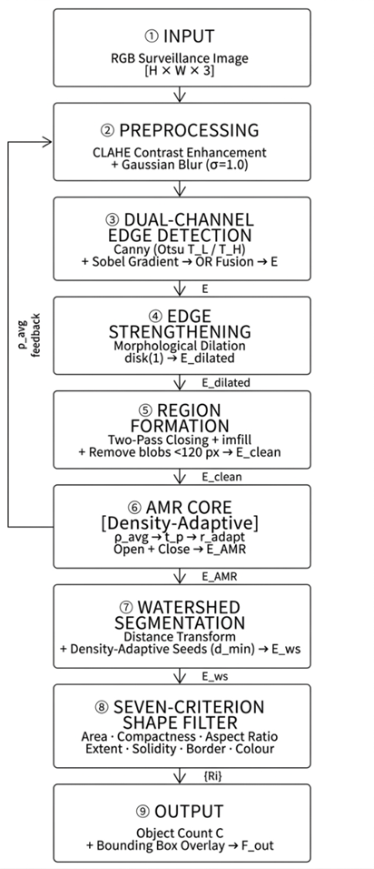

# Edge-Based Object Counting System for Smart City Applications

## Adaptive Morphological Segmentation Framework

### Research Publication

**Paper Title:**
**EDGE-BASED OBJECT COUNTING SYSTEM FOR SMART CITY APPLICATIONS: AN ADAPTIVE MORPHOLOGICAL SEGMENTATION FRAMEWORK**

**Publication Status:**
Accepted for publication in the International Journal of Innovative Science and Research Technology (IJISRT).

---

## Overview

Smart cities rely heavily on automated monitoring systems to analyze urban environments efficiently. Applications such as traffic management, crowd monitoring, surveillance, and infrastructure planning require accurate object detection and counting from visual data.

This project presents an adaptive image-processing framework that combines edge detection, morphological operations, and watershed segmentation to accurately identify and count objects in complex scenes. The proposed system is designed to improve segmentation quality, reduce noise, and provide reliable object counts suitable for smart city applications.

---

## Key Features

* Edge-based object detection
* Adaptive morphological segmentation
* Watershed-based object separation
* Shape-based object filtering
* Automated object counting
* Noise reduction and region refinement
* MATLAB implementation
* Smart city monitoring applications

---

# Methodology

The proposed framework follows a multi-stage image-processing pipeline to detect, segment, and count objects efficiently.

## System Architecture

  

> Replace **METHODOLOGY_IMAGE_NAME.png** with the actual filename of your methodology image.

---

## Processing Workflow

### 1. Image Acquisition

The system receives RGB images captured from surveillance cameras, traffic monitoring systems, or smart city datasets.

### 2. Image Preprocessing

To improve image quality and enhance object visibility, preprocessing techniques are applied:

* Contrast Limited Adaptive Histogram Equalization (CLAHE)
* Gaussian smoothing
* Noise reduction

These operations improve segmentation accuracy under varying lighting conditions.

### 3. Dual-Channel Edge Detection

Object boundaries are extracted using:

* Canny Edge Detection
* Sobel Gradient Analysis

The outputs are combined to generate a robust edge map that captures object contours effectively.

### 4. Morphological Edge Strengthening

Morphological dilation is performed to:

* Connect fragmented edges
* Improve boundary continuity
* Enhance region formation

### 5. Region Formation

The framework generates candidate object regions through:

* Morphological closing
* Hole filling
* Small blob removal

This stage produces cleaner object regions for further analysis.

### 6. Adaptive Morphological Refinement (AMR)

The AMR module dynamically adjusts morphological parameters based on object density and scene complexity.

This helps maintain segmentation quality across different environments.

### 7. Watershed Segmentation

Distance-transform-based watershed segmentation is used to separate overlapping and touching objects.

This is particularly useful in crowded scenes and dense traffic environments.

### 8. Seven-Criterion Shape Filtering

Detected regions are validated using multiple geometric constraints:

* Area
* Aspect Ratio
* Compactness
* Extent
* Solidity
* Border Constraints
* Shape Consistency

This eliminates false detections and improves counting accuracy.

### 9. Object Counting and Visualization

Validated objects are:

* Labeled
* Counted
* Displayed using bounding boxes

The final object count is generated automatically.

---

# Experimental Results

## People Counting

  

The framework successfully detects and counts individual objects in crowded environments while maintaining accurate object separation and localization.

---

## Vehicle Counting

  

The system can also be applied to traffic-monitoring applications where vehicles are automatically identified and counted from road surveillance imagery.

---

# Technologies Used

| Technology                   | Purpose             |
| ---------------------------- | ------------------- |
| MATLAB                       | Core Development    |
| Image Processing Toolbox     | Image Analysis      |
| Edge Detection Algorithms    | Boundary Extraction |
| Morphological Operations     | Region Refinement   |
| Watershed Segmentation       | Object Separation   |
| Connected Component Analysis | Object Counting     |

---

# Future Enhancements

* Real-time video stream processing
* Edge-AI deployment
* Deep learning integration
* Multi-camera object tracking
* Cloud-based analytics dashboard
* IoT-enabled smart city monitoring

---

# Author

**Ritika Palai**
**Pragya Mittal**
**Jesna Jixon**
**Mrudula Wani**

---

# Citation

If you use this work in your research, please cite the associated publication once officially published.

Citation details will be updated after publication.
